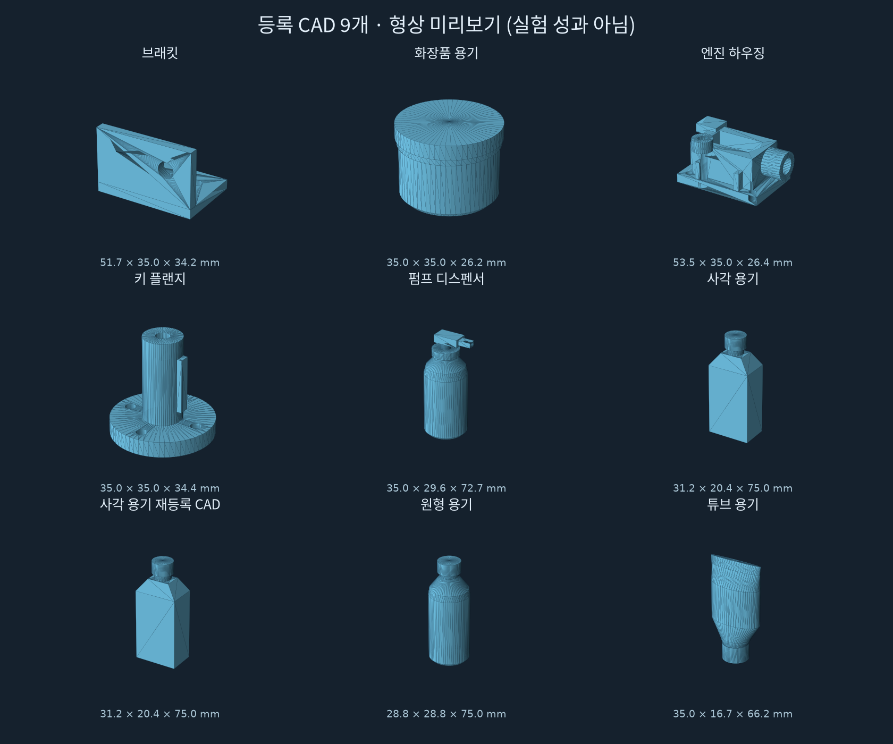

# Piper 9종 CAD · ENPIRE / ASPIRE 공개 보고서

## [보고서 바로 열기](https://steerix-home.github.io/piper-bin-picking-report/)

HTML 보고서가 첫 화면으로 열립니다. **6종 전량 성공, 3종 29/30, 총 인정 수거 267/270**입니다.
ENPIRE와 ASPIRE의 관계, 사용 흐름도, 품목별 미리보기와 실패 원인을 담았습니다.

공개 범위는 보고서 본문·미리보기·흐름도입니다. **실험 코드·영상·원본 로그·검증 파일은 비공개**입니다.
보고서의 영상·근거 링크는 권한이 있는 GitHub 사용자만 열 수 있습니다.

[보고서 Markdown](보고서.md) · [비공개 전체 자료](https://github.com/STEERIX-home/piper-bin-picking)

