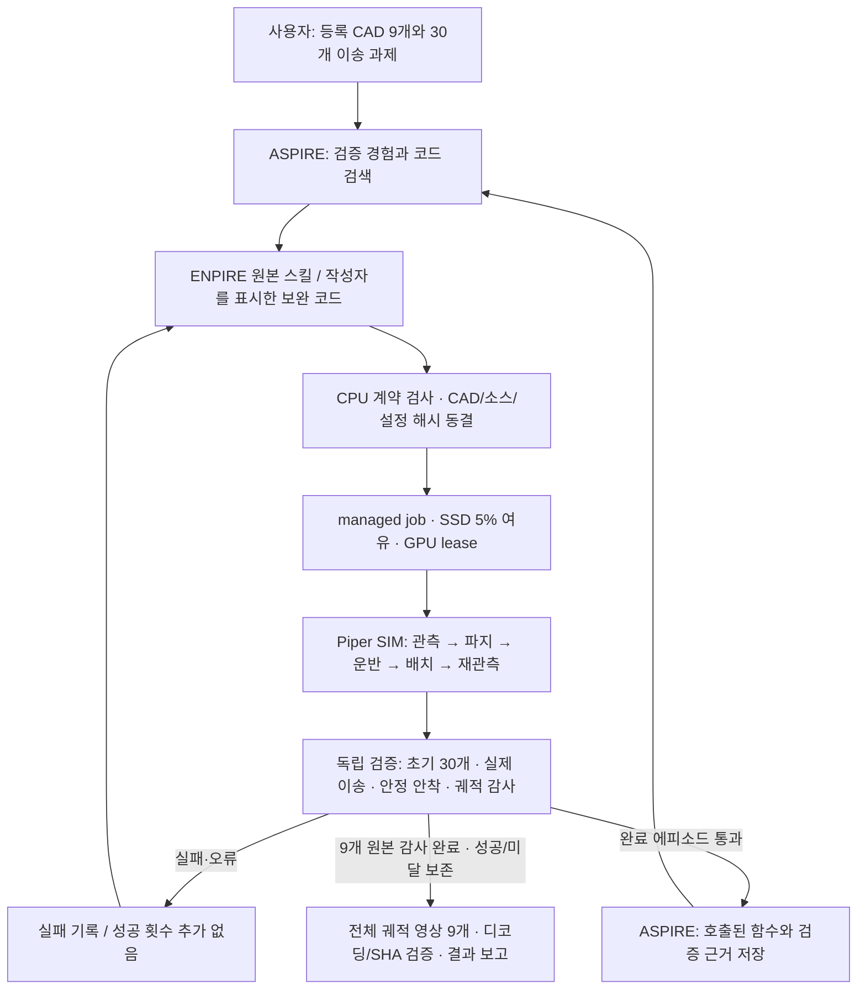

# Piper 9 CAD · ENPIRE / ASPIRE 결과

**9종 영상·결과 보고 완료 · 전량 성공 6/9종**  
갱신: 2026-09-14 18:42:07 KST  
검증 통과 6/9종 · 완료·유효 실행의 인정 수거 267개 · 검증된 영상 9/9개

[공개 HTML 보고서](https://steerix-home.github.io/piper-bin-picking-report/)에서 본문·미리보기·흐름도를 볼 수 있습니다. 영상과 원본 검증 자료의 링크는 비공개 GitHub 저장소 접근 권한이 필요합니다.

| CAD | 판정 | 검증 수거 | 파지 코드 | 장면 / 탐색 장치 | 시도 | 파지 실패 | 영상 |
|---|---|---:|---|---|---:|---:|---|
| 브래킷 | 미완료 | 29/30 | pick_program_v10 | cpu / cpu | 107 | 63 | [MP4](https://github.com/STEERIX-home/piper-bin-picking/blob/main/reports/20260914/%EC%98%81%EC%83%81/01_%EB%B8%8C%EB%9E%98%ED%82%B7_29-30.mp4) |
| 화장품 용기 | 검증 통과 | 30/30 | pick_program_v6 | cuda:0 / cuda | 30 | 0 | [MP4](https://github.com/STEERIX-home/piper-bin-picking/blob/main/reports/20260914/%EC%98%81%EC%83%81/02_%ED%99%94%EC%9E%A5%ED%92%88_%EC%9A%A9%EA%B8%B0_30-30.mp4) |
| 엔진 하우징 | 검증 통과 | 30/30 | pick_program_v10 | cuda:0 / cuda | 127 | 18 | [MP4](https://github.com/STEERIX-home/piper-bin-picking/blob/main/reports/20260914/%EC%98%81%EC%83%81/03_%EC%97%94%EC%A7%84_%ED%95%98%EC%9A%B0%EC%A7%95_30-30.mp4) |
| 키 플랜지 | 검증 통과 | 30/30 | pick_program_v6 | cuda:0 / cuda | 44 | 1 | [MP4](https://github.com/STEERIX-home/piper-bin-picking/blob/main/reports/20260914/%EC%98%81%EC%83%81/04_%ED%82%A4_%ED%94%8C%EB%9E%9C%EC%A7%80_30-30.mp4) |
| 펌프 디스펜서 | 미완료 | 29/30 | pick_program_v11 | cpu / cpu | 137 | 12 | [MP4](https://github.com/STEERIX-home/piper-bin-picking/blob/main/reports/20260914/%EC%98%81%EC%83%81/05_%ED%8E%8C%ED%94%84_%EB%94%94%EC%8A%A4%ED%8E%9C%EC%84%9C_29-30.mp4) |
| 사각 용기 | 검증 통과 | 30/30 | pick_program_v10 | cpu / cpu | 84 | 5 | [MP4](https://github.com/STEERIX-home/piper-bin-picking/blob/main/reports/20260914/%EC%98%81%EC%83%81/06_%EC%82%AC%EA%B0%81_%EC%9A%A9%EA%B8%B0_30-30.mp4) |
| 사각 용기 재등록 CAD | 검증 통과 | 30/30 | pick_program_v10 | cpu / cpu | 95 | 5 | [MP4](https://github.com/STEERIX-home/piper-bin-picking/blob/main/reports/20260914/%EC%98%81%EC%83%81/07_%EC%82%AC%EA%B0%81_%EC%9A%A9%EA%B8%B0_%EC%9E%AC%EB%93%B1%EB%A1%9D_CAD_30-30.mp4) |
| 원형 용기 | 검증 통과 | 30/30 | pick_program_v6 | cuda:0 / cuda | 102 | 0 | [MP4](https://github.com/STEERIX-home/piper-bin-picking/blob/main/reports/20260914/%EC%98%81%EC%83%81/08_%EC%9B%90%ED%98%95_%EC%9A%A9%EA%B8%B0_30-30.mp4) |
| 튜브 용기 | 미완료 | 29/30 | pick_program_v9 | cpu / cpu | 121 | 2 | [MP4](https://github.com/STEERIX-home/piper-bin-picking/blob/main/reports/20260914/%EC%98%81%EC%83%81/09_%ED%8A%9C%EB%B8%8C_%EC%9A%A9%EA%B8%B0_29-30.mp4) |

진행 중 수치는 잠정값입니다. 검증 오류가 난 실행은 표시된 내부 수거 수와 관계없이 인정 수거 합계에서 제외합니다. 9개 등록 항목에는 사각 용기 재등록본이 포함됩니다.

## 이번 회차에서 미달한 3종

펌프 디스펜서: 물체 23번의 최종 CAD 외곽이 수납함의 기존 3mm 판정 여유를 0.49mm 더 넘어섰습니다. 29/30으로 기록했습니다.

브래킷: 물체 23번의 최종 CAD 외곽이 수납함의 기존 3mm 판정 여유를 1.74mm 더 넘어섰습니다. 29/30으로 기록했습니다.

튜브 용기: 마지막 물체 27번을 파지해 운반하던 중 60분 계산 예산에 도달했습니다. 내려놓기 전 종료되어 29/30이며, 완료로 인정하지 않았습니다.

[원본 종료 상태 재검사](https://github.com/STEERIX-home/piper-bin-picking/blob/main/reports/20260914/%EA%B2%80%EC%A6%9D%EA%B7%BC%EA%B1%B0/20260914-090234-piper-cad9-outcome-report-4a96/outputs/incomplete-final-state-audit.json)

이후 별도로 진행한 root 작성 V12 펌프 후보는 독립 실행 2회 중 1회가 30/30에 성공했고, 1회는 미달했습니다. 추가 ASPIRE 기록에는 완결 성공 1개와 실패·미완료 2개(앞선 V11 시험 포함)를 구분했습니다. 이 후속 결과는 위 9종 회차의 6/9종·267개 성과에 합산하지 않습니다. 새 root 코드의 재사용 승격 기준은 독립 성공 2회이며, 실행 중 판정 기준은 유지했습니다.

## ENPIRE와 ASPIRE의 관계

이번 Piper 연결에서 ENPIRE는 실패 관측을 받아 실행 가능한 Python 스킬을 작성·개선하고 버전과 부모 관계를 관리하는 역할입니다. 실제 ENPIRE SkillAuthorStep으로 작성된 파지·접촉 감지·복구 스킬을 사용합니다. ENPIRE 자체의 작성용 SkillLibrary도 따로 있습니다.

ASPIRE에서는 여러 완료 에피소드에서 재사용할 함수를 저장하고 검색하는 기억 기능을 연결했습니다. 실제 ASPIRE SkillLibrary의 add_skill, get_promoted_skills, get_skill_docs를 사용합니다. 성공 횟수는 함수 호출 프레임 수가 아니라 독립 검증을 통과한 에피소드 단위로 기록합니다. 실패·중단·검증 오류는 별도 기록하며 성공 횟수를 더하지 않습니다.

두 시스템은 ‘검증된 경험을 ASPIRE에서 검색 → ENPIRE에서 재사용하거나 필요한 코드를 개선 → Piper에서 실행 → 독립 검증 → 다음 경험으로 저장’으로 연결됩니다. 이번 동결 시험은 기존 ENPIRE 코드를 ASPIRE에서 확인한 뒤 시작 전에 CAD 해시별 구성을 확정합니다. 실행 중 매 제어 프레임에 LLM을 호출하거나 ASPIRE가 모터를 직접 구동하는 구조는 아닙니다. CAD별 선택 규칙은 Piper 통합 코드의 사전 규칙이며 ASPIRE가 학습한 신경망 정책이 아닙니다.

배치 후보 분산 기능을 적용한 품목은 실행 설정에 spread_v1로 기록합니다. 이 기능은 Piper 기본 계획기의 별도 수정이며 ENPIRE가 작성한 새 스킬로 집계하지 않습니다. 물리·평가 기준은 유지했습니다.

이는 코드 스킬 개선·재사용 실험입니다. 새 VLA 체크포인트 학습, ENPIRE/ASPIRE 공식 벤치마크 재현, 미사용 CAD 일반화 성능으로 해석하지 않습니다.

[ENPIRE 사용 흐름 설명 영상](https://github.com/STEERIX-home/piper-bin-picking/blob/main/reports/20260914/%EC%98%81%EC%83%81/10_ENPIRE_%EC%82%AC%EC%9A%A9%ED%9D%90%EB%A6%84.mp4)
[ASPIRE 사용 흐름 설명 영상](https://github.com/STEERIX-home/piper-bin-picking/blob/main/reports/20260914/%EC%98%81%EC%83%81/11_ASPIRE_%EC%82%AC%EC%9A%A9%ED%9D%90%EB%A6%84.mp4)
설명 영상은 원본 기록을 설명하는 정적 슬라이드이며, 형상별 실제 SIM 궤적 영상은 위 결과 표에서 확인합니다.

## 사용 흐름

1. 등록 CAD와 수량을 확인하고 ASPIRE의 성공 코드·관련 실패 기록을 검색합니다.
2. 재사용 코드가 부족하면 에피소드 사이에 ENPIRE 또는 작성자를 명시한 보완 코드로 수정하고 CPU 계약 검사를 통과시킵니다.
3. 스킬·CAD·실행 조건을 동결하고 managed job을 만듭니다. 최대 출력 후에도 SSD 5% 여유를 남기고 GPU lease를 확보합니다.
4. 9개 독립 바구니를 실행합니다. 실행 중인 소스나 성공 판정 조건은 바꾸지 않습니다.
5. 원본 기록으로 독립 검증합니다. 실패하면 원인을 남겨 다음 수정으로 돌리고, 통과한 완료 에피소드만 ASPIRE 성공 경험에 추가합니다.
6. 같은 캠페인 9개의 원본을 감사한 뒤 성공·미달 판정을 보존한 영상 9개를 생성·검증하고 이 보고서에서 확인합니다. 종료된 managed job은 보존 심사를 위해 등록합니다.

## 검증과 영상의 의미

각 등록 CAD마다 새 한 바구니에 30개를 함께 넣고 seed 7에서 시작합니다. 물체는 모두 25g으로 설정한 강체이며 충돌은 볼록 외곽 형상으로 근사합니다. 화면과 카메라 깊이에는 전체 CAD를 사용하지만, 구멍 내부 접촉·튜브 변형·실물 재질의 물성은 이 시험에서 검증하지 않습니다. 등록 CAD·스킬 소스·환경 코드·수치 설정의 해시를 시작 전에 고정합니다. 접촉 물리 계산은 MuJoCo CPU로 수행하며, 장면·깊이 관측과 탐색의 CPU/GPU 구성은 표에 구분합니다. SIM 손목 카메라의 관측과 측정 관절·접촉으로 정책을 실행하며 평가용 물체 정답 자세는 정책 입력에 사용하지 않습니다.

깊이 영상은 불투명 표면의 합성 관측에 0.30 mm 가우시안 잡음과 2.5% 누락을 적용한 것으로, 실측 DaBai 카메라의 보정 모델은 아닙니다. 기존 장면에서 로봇 자체 충돌 검사는 비활성 상태이며, 이 시험으로 실로봇 동작의 안전성을 판정하지 않습니다.

완료는 30개 모두 물리적으로 들어 올려 CAD 전체가 수납함 경계 판정 범위(기존 3mm 허용 여유) 안에 놓이고, 45프레임 동안 위치 1 mm·회전 1도 이내로 안정된 상태인지 검사합니다. 10 Hz 저장 궤적에서 작업대/바닥 아래 이탈을 별도로 감사하고, 초기 30개·중간 리셋 없음·소스 해시·정책 해시·정상 종료·스킬 오류 0건을 확인합니다. 일부 수거, 정답 자세 강제 변경, 과거 성공 영상 조합은 전체 성공으로 집계하지 않습니다.

영상 제작 전에 같은 캠페인의 9개 원본 기록을 모두 독립 감사했습니다. 보고서 완료는 영상과 기록의 검증 완료를 뜻하며, 9종 전량 이송 성공을 뜻하지 않습니다. 목표 미달 3종의 29/30 판정도 그대로 보존합니다. 영상은 저장된 측정 관절과 평가용 물체 자세로 기존 작업대를 다시 그린 전체 궤적 재생입니다. 우측 영상은 SIM에서 당시 저장한 검색 RGB와 측정 깊이이며 다음 촬영까지 유지합니다. 실패·재시도 구간을 잘라내지 않습니다. 생중계 녹화와 구분해 영상에 표시하고, 완성 MP4의 전체 디코딩과 SHA-256을 검증합니다.

이 회차의 사전 계산 시간 예산은 모든 품목 60분이며, 시도 상한은 각 360회입니다. 시간 한도에 도달한 부분 실행도 미완료로 기록합니다. 실행 시간 예산이 다른 과거 회차와 처리 속도를 단순 비교하지 않습니다.

## 실패 개선을 위한 별도 개발 시험

별도의 새 30개 개발 시험입니다. 각 후보의 물리 실행·검색·배치 조건을 명시했습니다. 부분 재현 장면을 이어 쓰지 않았습니다. 이 표의 결과는 위 9종 캠페인 성과와 합산하지 않습니다.

| 후보 CAD | 잠정 수거 | 상태 |
|---|---:|---|
| 사각 용기 | 30/30 | 30/30 검증 통과 |
| 엔진 하우징 · GPU 추가 시험 | 30/30 | 30/30 검증 통과 |
| 사각 용기 · 분산 배치 | 30/30 | 30/30 검증 통과 |
| 튜브 V9 · CPU 분산 배치 | 30/30 | 30/30 검증 통과 |
| 펌프 V11 · CPU 검색 | 30/30 | 30/30 검증 통과 |
| 튜브 V10 · 접촉 감지 | 집계 제외 | 중단 · 성공 집계 제외 |
| 튜브 V9 · GPU 분산 배치 | 집계 제외 | 중단 · 성공 집계 제외 |
| 브래킷 · V6 분산 배치 | 29/30 | INCOMPLETE_BIN |
| 브래킷 · V10 접촉 감지 + 분산 배치 | 30/30 | 30/30 검증 통과 |
| 브래킷 · V11 접촉 감지 + 분산 배치 | 30/30 | 30/30 검증 통과 |
| 펌프 디스펜서 · V10 관측 기반 후보 선택 | 집계 제외 | ValueError: Operator/interrupted stop is not a completed compact trial |
| 사각 용기 재등록 CAD · V10 분산 배치 | 30/30 | 30/30 검증 통과 |
| 펌프 디스펜서 · V11 관측 기반 후보 선택 | 30/30 | 30/30 검증 통과 |
| 펌프 V11 · 관측 후보 선택 + 분산 배치 | 29/30 | INCOMPLETE_BIN |
| 펌프 · root 작성 V12 재시도 · 독립 실행 a | 30/30 | 30/30 검증 통과 |
| 펌프 · root 작성 V12 재시도 · 독립 실행 b | 28/30 | INCOMPLETE_BIN |

## 서버 정리 결과

승인된 옛 VLA/OVRTX 런타임 3개를 정리해 실제 SSD 가용 공간 59.00 GiB를 확보했습니다. 정리 직후 가용량은 105.75 GiB, 운영 예비 공간은 45.7 GiB(5%)입니다. 현재 실험 런타임·등록 CAD·데이터셋·프로젝트는 유지했습니다. [정리 감사 기록](https://github.com/STEERIX-home/piper-bin-picking/blob/main/reports/20260914/%EA%B2%80%EC%A6%9D%EA%B7%BC%EA%B1%B0/20260914-015740-vla-cleanup-3-6b22/outputs/CLEANUP_KO.md)

바탕화면의 잘못된 PC 종료 바로가기를 제거하고 Stereo Lab 서버 시작 / 종료로 교체했습니다. 실제 HTTP 응답과 반복 시작·종료를 확인했습니다.

현재 SSD 파티션과 용도별 사용량, 실험·체크포인트의 보존 상태는 [SSD 사용 현황](https://github.com/STEERIX-home/piper-bin-picking/blob/main/reports/20260914/SSD_%EC%82%AC%EC%9A%A9%ED%98%84%ED%99%A9.md)에서 확인할 수 있습니다.

## 근거와 범위

- 실행 원본: [20260914-051937-piper-cad9-r4-3cea](https://github.com/STEERIX-home/piper-bin-picking/blob/main/reports/20260914/%EA%B2%80%EC%A6%9D%EA%B7%BC%EA%B1%B0/20260914-051937-piper-cad9-r4-3cea/outputs/%EC%B0%B8%EC%A1%B0%ED%8C%8C%EC%9D%BC%EB%AA%A9%EB%A1%9D.html)
- 동결 설정: [protocol.json](https://github.com/STEERIX-home/piper-bin-picking/blob/main/reports/20260914/%EA%B2%80%EC%A6%9D%EA%B7%BC%EA%B1%B0/20260914-051937-piper-cad9-r4-3cea/outputs/validation-confirm/protocol.json)
- CAD별 스킬: [portfolio.json](https://github.com/STEERIX-home/piper-bin-picking/blob/main/reports/20260914/%EA%B2%80%EC%A6%9D%EA%B7%BC%EA%B1%B0/20260914-051937-piper-cad9-r4-3cea/outputs/validation-confirm/portfolio.json)
- 실제 ASPIRE 검색: [실제 검색 기록](https://github.com/STEERIX-home/piper-bin-picking/blob/main/reports/20260914/%EA%B2%80%EC%A6%9D%EA%B7%BC%EA%B1%B0/20260914-051937-piper-cad9-r4-3cea/outputs/next-portfolio/actual-retrieval.json)
- ENPIRE 원본 작성·부모 버전·CPU 검사: [manifest.json](https://github.com/STEERIX-home/piper-bin-picking/blob/main/reports/20260914/%EA%B2%80%EC%A6%9D%EA%B7%BC%EA%B1%B0/20260914-090234-piper-cad9-outcome-report-4a96/outputs/relationship-evidence/manifest.json)
- ENPIRE 소스 pin: 99ee90acf65b5b18957c8382ad580db999528be3
- ASPIRE 소스 pin: f4c8939aab0af9b97690c561bd80e282940f7886
- 개발 seed 7의 등록 형상 SIM 결과이며, 미사용 seed·새 CAD·실로봇 산업 신뢰성은 검증하지 않았습니다.

후속 실패 진단과 후보 조건: [진단 기록](https://github.com/STEERIX-home/piper-bin-picking/blob/main/reports/20260914/%EA%B2%80%EC%A6%9D%EA%B7%BC%EA%B1%B0/20260914-033232-piper-place-gap-84ac/outputs/INVESTIGATION_KO.md)

후속 펌프 검증: [완료 감사](https://github.com/STEERIX-home/piper-bin-picking/blob/main/reports/20260914/%EA%B2%80%EC%A6%9D%EA%B7%BC%EA%B1%B0/20260914-073858-piper-cad9-r5-44f8/outputs/closed-pump-followup-reaudits.json) · [별도 ASPIRE 기억 기록](https://github.com/STEERIX-home/piper-bin-picking/blob/main/reports/20260914/%EA%B2%80%EC%A6%9D%EA%B7%BC%EA%B1%B0/20260914-073858-piper-cad9-r5-44f8/outputs/memory-after-pump-followup/evidence.json)

브래킷 후속 진단: [경계 이탈과 개선 시험](https://github.com/STEERIX-home/piper-bin-picking/blob/main/reports/20260914/%EA%B2%80%EC%A6%9D%EA%B7%BC%EA%B1%B0/20260914-051423-piper-bracket-placement-a710/outputs/DECISION_KO.md)

## 9종 전체 회차 이력

회차 사이에 후보 구성을 수정했습니다. 아래의 과거 성공을 이번 최종 성공에 합산하지 않습니다.

| 회차 | 30개 통과 품목 | 검증 유효 / 종료 품목 | 인정 수거 | 상태 |
|---|---:|---:|---:|---|
| [재개 1](https://github.com/STEERIX-home/piper-bin-picking/blob/main/reports/20260914/%EA%B2%80%EC%A6%9D%EA%B7%BC%EA%B1%B0/20260914-014339-piper-cad9-r2-19f0/outputs/validation-resume/result.json) | 6/9 | 8/9 | 238 | 종료 |
| [재개 2](https://github.com/STEERIX-home/piper-bin-picking/blob/main/reports/20260914/%EA%B2%80%EC%A6%9D%EA%B7%BC%EA%B1%B0/20260914-020709-cad9-completion-4b48/outputs/validation-confirm/result.json) | 6/9 | 9/9 | 266 | 종료 |
| [전체 재검증 1](https://github.com/STEERIX-home/piper-bin-picking/blob/main/reports/20260914/%EA%B2%80%EC%A6%9D%EA%B7%BC%EA%B1%B0/20260914-035408-piper-cad9-final-dffc/outputs/validation-confirm/result.json) | 5/9 | 8/8 | 236 | 중단 |
| [보완 후 전체 재검증 2](https://github.com/STEERIX-home/piper-bin-picking/blob/main/reports/20260914/%EA%B2%80%EC%A6%9D%EA%B7%BC%EA%B1%B0/20260914-051937-piper-cad9-r4-3cea/outputs/validation-confirm/result.json) | 6/9 | 9/9 | 267 | 종료 |

펌프·재등록 CAD 후속 진단: [실패 원인과 후보 조건](https://github.com/STEERIX-home/piper-bin-picking/blob/main/reports/20260914/%EA%B2%80%EC%A6%9D%EA%B7%BC%EA%B1%B0/20260914-055947-piper-placement-followup-5e6b/outputs/DECISION_KO.md)

펌프 추가 배치 진단: [23번 경계 이탈과 분산 배치 후보](https://github.com/STEERIX-home/piper-bin-picking/blob/main/reports/20260914/%EA%B2%80%EC%A6%9D%EA%B7%BC%EA%B1%B0/20260914-072535-piper-pump-placement-9c8e/outputs/DECISION_KO.md)

이번 보완 설정과 시간 예산: [선택 근거](https://github.com/STEERIX-home/piper-bin-picking/blob/main/reports/20260914/%EA%B2%80%EC%A6%9D%EA%B7%BC%EA%B1%B0/20260914-090234-piper-cad9-outcome-report-4a96/outputs/REVISION_KO.md)

펌프 접촉 지점 재시도: [기하 진단·작성자·독립 실험 조건](https://github.com/STEERIX-home/piper-bin-picking/blob/main/reports/20260914/%EA%B2%80%EC%A6%9D%EA%B7%BC%EA%B1%B0/20260914-082929-piper-pump-recovery-aeea/outputs/DECISION_KO.md)
